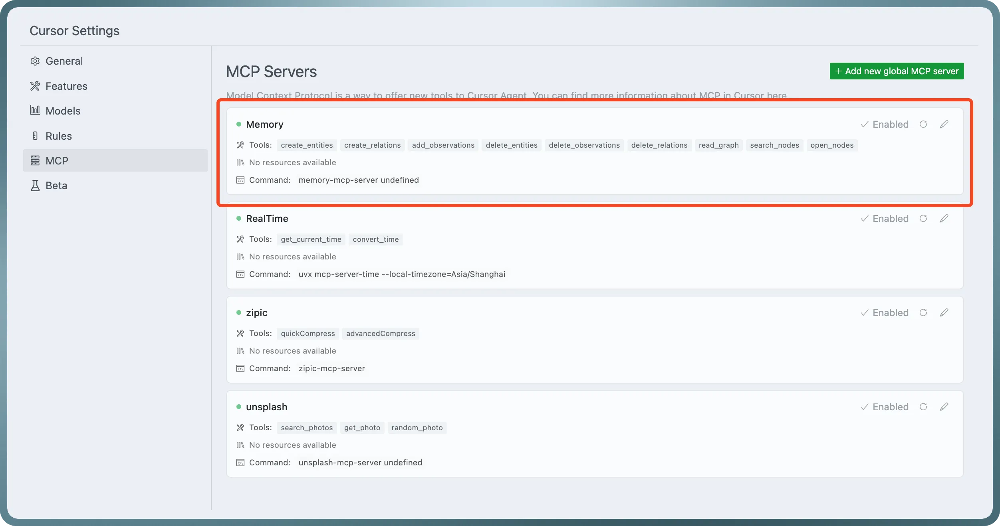

# Memory MCP Server

> A Model Context Protocol server that provides knowledge graph management capabilities. This server enables LLMs to create, read, update, and delete entities and relations in a persistent knowledge graph, helping AI assistants maintain memory across conversations. This is a Swift implementation of the official [TypeScript Memory MCP Server](https://github.com/modelcontextprotocol/servers/tree/main/src/memory).

**Note:** This Swift version requires **macOS 14.0 or later**. For broader platform support (including Windows, Linux, and macOS 11.0+), check out the Go language implementation: **[memory-mcp-server-go](https://github.com/okooo5km/memory-mcp-server-go)**.


## ✨ Features

* **Knowledge Graph Storage**: Maintain a persistent graph of entities and their relationships
* **Entity Management**: Create, retrieve, update, and delete entities with custom types
* **Relation Tracking**: Define and manage relationships between entities in active voice
* **Observation System**: Add and remove observations about entities over time
* **Powerful Search**: Find relevant nodes by name, type, or observation content
* **Persistent Storage**: Data persists between sessions in a simple JSON format

## Available Tools

* `create_entities` - Create multiple new entities in the knowledge graph
  * `entities` (array, required): Array of entity objects to create
    * `name` (string): The name of the entity
    * `entityType` (string): The type of the entity
    * `observations` (array of strings): Observations associated with the entity

* `create_relations` - Create multiple new relations between entities
  * `relations` (array, required): Array of relation objects
    * `from` (string): The name of the entity where the relation starts
    * `to` (string): The name of the entity where the relation ends
    * `relationType` (string): The type of the relation (in active voice)

* `add_observations` - Add new observations to existing entities
  * `observations` (array, required): Array of observation additions
    * `entityName` (string): The name of the entity to add observations to
    * `contents` (array of strings): The observations to add

* `delete_entities` - Delete multiple entities and their associated relations
  * `entityNames` (array, required): Array of entity names to delete

* `delete_observations` - Delete specific observations from entities
  * `deletions` (array, required): Array of observation deletions
    * `entityName` (string): The name of the entity containing the observations
    * `observations` (array of strings): The observations to delete

* `delete_relations` - Delete multiple relations from the knowledge graph
  * `relations` (array, required): Array of relation objects to delete
    * `from` (string): The source entity name
    * `to` (string): The target entity name
    * `relationType` (string): The relation type

* `read_graph` - Read the entire knowledge graph
  * No parameters required

* `search_nodes` - Search for nodes in the knowledge graph based on a query
  * `query` (string, required): Search query to match against entity names, types, and observations

* `open_nodes` - Open specific nodes in the knowledge graph by their names
  * `names` (array, required): Array of entity names to retrieve

## Installation

### Option 1: One-Line Installation (curl)

The easiest way to install is with the one-line installer, which automatically downloads the latest version and installs it to `~/.local/bin` in your home directory:

```bash
curl -fsSL https://raw.githubusercontent.com/okooo5km/memory-mcp-server/main/install.sh | bash
```

The installer will:

* Create `~/.local/bin` if it doesn't exist
* Add this directory to your PATH (in .zshrc or .bashrc)
* Download and install the latest version
* Make the binary executable

### Option 2: Build from Source

1. Clone the repository:

   ```bash
   git clone https://github.com/okooo5km/memory-mcp-server.git
   cd memory-mcp-server
   ```

2. Build the project:

   ```bash
   swift build -c release
   ```

3. Install the binary:

   ```bash
   # Install to user directory (recommended, no sudo required)
   mkdir -p ~/.local/bin
   cp $(swift build -c release --show-bin-path)/memory-mcp-server ~/.local/bin/
   ```

   Make sure `~/.local/bin` is in your PATH by adding to your shell configuration file:

   ```bash
   echo 'export PATH="$HOME/.local/bin:$PATH"' >> ~/.zshrc  # or ~/.bashrc
   source ~/.zshrc  # or source ~/.bashrc
   ```

## Command Line Arguments

The server supports the following command line arguments:

* `-h, --help`: Display help information about the server, its usage, and available options
* `-v, --version`: Display the version number of the memory-mcp-server

Example usage:

```bash
# Display help information
memory-mcp-server --help

# Display version information
memory-mcp-server --version
```

## Configuration

### Environment Variables

The server supports the following environment variables:

* `MEMORY_FILE_PATH`: Custom path for storing the knowledge graph (optional)
  * If not specified, defaults to `memory.json` in the current working directory
  * Can be an absolute path or relative to the current working directory

You can check the configured file path in the server logs when starting the server.

```bash
export MEMORY_FILE_PATH="/path/to/your/memory.json"
```

### Configure for Claude.app

Add to your Claude settings:

```json
"mcpServers": {
  "memory": {
    "command": "memory-mcp-server",
    "env": {
      "MEMORY_FILE_PATH": "/path/to/your/memory.json"
    }
  }
}
```

### Configure for Cursor

Add the following configuration to your Cursor editor's Settings - mcp.json:

```json
{
  "mcpServers": {
    "memory": {
      "command": "memory-mcp-server",
      "env": {
        "MEMORY_FILE_PATH": "/path/to/your/memory.json"
      }
    }
  }
}
```



### Configure for Chatwise

Add the memory MCP server to your Chatwise Settings - Tools.


### Example System Prompt

You can use the following system prompt to help Claude utilize the memory-mcp-server effectively:

```
You have access to a Knowledge Graph memory system, which can store and retrieve information across conversations. Use it to remember important details about the user, their preferences, and any facts they've shared.

When you discover important information, save it using memory tools:
- `create_entities` to add new people, places, or concepts
- `create_relations` to record how entities relate to each other
- `add_observations` to record facts about existing entities

Before answering questions that might require past context, check your memory:
- `search_nodes` to find relevant information
- `open_nodes` to retrieve specific entities
- `read_graph` to get a complete view of your knowledge

Always prioritize information from your memory when responding to the user, especially when they reference past conversations.
```

## Development Requirements

* Swift 6.0 or later
* macOS 14.0 or later
* MCP Swift SDK 0.2.0 or later

## Knowledge Graph Structure

The Memory MCP Server uses a simple graph structure to store knowledge:

* **Entities**: Nodes in the graph with a name, type, and list of observations
* **Relations**: Edges between entities with a relation type in active voice
* **Observations**: Facts or details associated with entities

The knowledge graph is persisted to disk as a line-delimited JSON file, where each line is either an entity or relation object.

## Usage Examples

### Creating Entities

```json
{
  "entities": [
    {
      "name": "John Smith",
      "entityType": "Person",
      "observations": ["Software engineer", "Lives in San Francisco", "Enjoys hiking"]
    },
    {
      "name": "Acme Corp",
      "entityType": "Company",
      "observations": ["Founded in 2010", "Tech startup"]
    }
  ]
}
```

### Creating Relations

```json
{
  "relations": [
    {
      "from": "John Smith",
      "to": "Acme Corp",
      "relationType": "works at"
    }
  ]
}
```

### Adding Observations

```json
{
  "observations": [
    {
      "entityName": "John Smith",
      "contents": ["Recently promoted to Senior Engineer", "Working on AI projects"]
    }
  ]
}
```

### Searching Nodes

```json
{
  "query": "San Francisco"
}
```

### Opening Specific Nodes

```json
{
  "names": ["John Smith", "Acme Corp"]
}
```

## Use Cases

* **Long-term Memory for AI Assistants**: Enable AI assistants to remember user preferences, past interactions, and important facts
* **Knowledge Management**: Organize information about people, places, events, and concepts
* **Relationship Tracking**: Maintain networks of relationships between entities
* **Context Persistence**: Preserve important context across multiple sessions
* **Journal and Daily Logs**: Maintain a structured record of events, activities, and reflections over time, making it easy to retrieve and relate past experiences chronologically

## Version History

See GitHub Releases for version history and changelog.

## ☕️ Support the Project

If you find Memory MCP Server helpful, please consider supporting its development:

* ⭐️ Star the project on GitHub
* 🐛 Report bugs or suggest features
* 💝 Support via:

<p align="center">
  <a href="https://buymeacoffee.com/okooo5km">
    
  </a>
</p>

## License

memory-mcp-server is licensed under the MIT License. This means you are free to use, modify, and distribute the software, subject to the terms and conditions of the MIT License.

## About

A Swift implementation of a knowledge graph memory server for Model Context Protocol (MCP), enabling persistent memory capabilities for large language models. This project is based on the [official TypeScript implementation](https://github.com/modelcontextprotocol/servers/tree/main/src/memory) but rewritten in Swift using the MCP Swift SDK.
